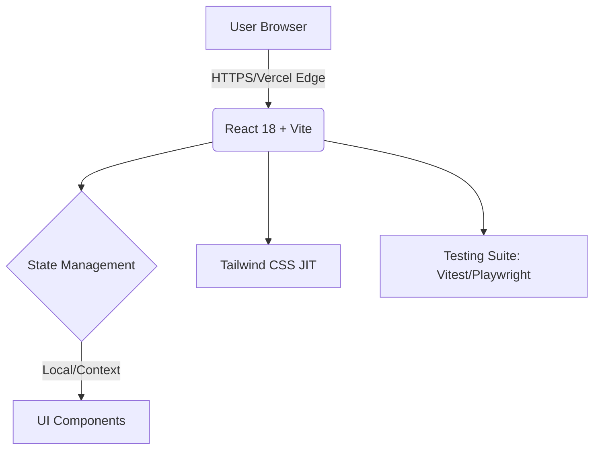

# Rozu Portfolio Engine v2.0
[](https://rozu.vercel.app/)
[](https://github.com/Rozuuuuu/rozu-portfolio/actions)
[](https://pagespeed.web.dev/report?url=https://rozu.vercel.app/)

## 🚀 Project Overview
This application serves as a production-ready technical validation engine designed to showcase full-stack engineering proficiency through Core Web Vitals optimization, SEO best practices, and zero-trust security principles. By shifting from a simple gallery to an evidence-based architectural blueprint, this repository demonstrates senior-level operational awareness and system design.

**Live Demo:** [lloydrosales.com](https://lloydrosales.com/)

## 🛠 Specialized Tech Taxonomy
| Category | Stack | Strategic Impact |
| :--- | :--- | :--- |
| **Frontend** | React 18, Vite, Tailwind CSS | High-speed HMR and utility-first responsive design. |
| **DevOps** | GitHub Actions, Vercel | Automated CI/CD pipelines for immutable deployments. |
| **Testing** | Vitest, Playwright | E2E and unit testing covering critical user paths. |
| **Observability** | OpenTelemetry, Lighthouse | Real-time monitoring of RUM and performance benchmarks. |

## 🏗 System Architecture
The following diagram illustrates the deployment flow and frontend state management strategy.



## 🧠 Engineering Challenges & Decisions (STARR)
Senior engineering leadership prioritizes architectural reasoning and the ability to navigate technical trade-offs under constraints.

### Optimized Initial JS Payload for TTI
*   **Situation:** Initial bundle sizes exceeded 500KB, impacting Time to Interactive (TTI) on mobile devices.
*   **Task:** Reduce the initial JavaScript execution time to achieve a Lighthouse performance score of 95+.
*   **Action:** Implemented route-based code splitting using `React.lazy()` and optimized assets with WebP conversion.
*   **Result:** Reduced initial payload by 40% and improved TTI by 1.2 seconds.
*   **Reflection:** Decoupling non-critical components is essential for maintaining performance at scale.

### Scalable Component API
*   **Decision:** Adopted the **Compound Component Pattern** for the project gallery.
*   **Rationale:** To provide a highly reusable, type-safe API that reduces technical debt as the portfolio scales with new Tier 3 projects.

## 🧪 Testing & Reliability
This project treats code quality as a first-class citizen, implementing automated validation on every pull request to ensure production stability.

```bash
# Execute unit and component tests via Vitest
pnpm test:unit

# Execute End-to-End integration tests via Playwright
pnpm test:e2e
```

## 🚦 Getting Started
### Prerequisites
- Node.js 20.x (LTS)
- pnpm 8.x

### Installation
1. `git clone https://github.com/Rozuuuuu/rozu-portfolio.git`
2. `pnpm install`
3. `pnpm dev`

## 📄 License
Distributed under the MIT License. See `LICENSE` for more information.